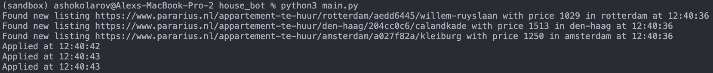
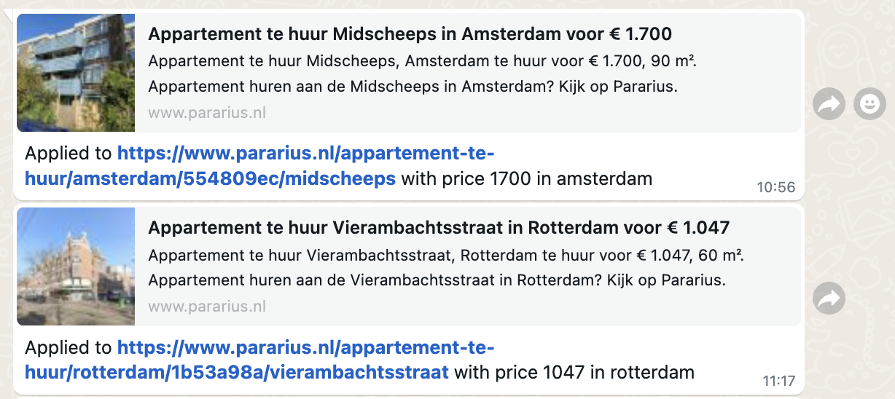

# ParariusBot

Three months ago, I started looking for a new apartment to move into in Amsterdam, and for anyone not familiar with the housing crisis in the Netherlands (I was not 😬), it is not an easy task. There are many rental websites, but due to the massive amount of applicants, if you are not one of the first to apply, your chances of even getting a viewing are minimal. Services that apply automatically exist (RentSlam, etc.), but I found them to be a bit too expensive, and so I set out to develop my own bot to automatically apply to listings for me and send me updates when it does so. And so...

ParariusBot is a Python-based automation tool designed to streamline the application process for housing listings on [Pararius](https://www.pararius.com/). By utilizing predefined filters, the bot automatically applies to new listings that match your criteria, saving you time and effort in your housing search.

## Features

- **Automated Applications**: Automatically applies to new listings on Pararius that meet your specified filters.
- **Customizable Filters**: Define your preferences to ensure the bot targets listings that suit your needs.
- **Efficient Workflow**: Reduces the manual effort involved in applying to multiple housing listings.

## Requirements

- **Python**: Ensure you have Python 3.11 installed on your system.
- **Selenium**: The bot uses the Selenium framework for web automation. If you haven't already, set up Selenium by following the instructions [here](https://www.selenium.dev/documentation/).

## Setup

1. **Clone the Repository**:
```bash 
git clone https://github.com/ashokolarov/ParariusBot.git
cd ParariusBot
```

2. **Configure your credentials and search settings in the config.yaml**:

``` 
bot_settings:
  email: "" # Pararius email
  password: "" # Pararius password

locations:
  default:
    url: "https://www.pararius.com/huurwoningen"
    min_price: 800 # Minimum price
    max_price: 1550 # Maximum price
    min_area: 45 # Minimum area
    min_rooms: 2 # Minimum number of rooms
    message: "Message to send with every application"
    applied_listings_location: "applied_listings"

  # You can override settings for each location you want search
  den-haag:
  rotterdam:
  Amsterdam:
```

3. **Usage**:
Run the bot by executing the main.py script:

```bash
python main.py
```

The bot will monitor Pararius for new listings that match your predefined filters and automatically submit applications on your behalf.

4. **Notification**:
There are currently two options for getting notified when the bot has applied to a location.

  ***Console***
  By default, the bot prints out every match it finds and when it is finished applying to it in the console, as seen below:

  

  ***Twilio***
  You can also set up your Twilio connection by providing you API keys in the config.yaml to receive updates on WhatsApp as seen below:
  

## Contributing
Contributions are welcome! If you have suggestions for improvements or encounter any issues, feel free to open an issue or submit a pull request.
