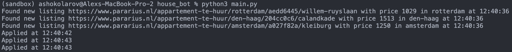

# ParariusBot

Three months ago, I started looking for a new apartment to move into in Amsterdam, and for anyone not familiar with the housing crisis in the Netherlands (I was not 😬), it is not an easy task. There are many rental websites, but due to the massive amount of applicants, if you are not one of the first to apply, your chances of even getting a viewing are minimal. Services that apply automatically exist (RentSlam, etc.), but I found them to be a bit too expensive, and so I set out to develop my own bot to automatically apply to listings for me and send me updates when it does so. And so...

ParariusBot is a Python-based automation tool designed to streamline the application process for housing listings on [Pararius](https://www.pararius.com/). By utilizing predefined filters, the bot automatically applies to new listings that match your criteria, saving you time and effort in your housing search.

## Features

- **Automated Applications**: Automatically applies to new listings on Pararius that meet your specified filters.
- **Customizable Filters**: Define your preferences to ensure the bot targets listings that suit your needs.
- **Efficient Workflow**: Reduces the manual effort involved in applying to multiple housing listings.
- **Instant Notifications**: Messages you on Telegram (or just prints to the console) the moment it applies to a listing.

## Requirements

- **Python**: 3.10 or newer.
- **Google Chrome**: the bot drives a real Chrome installation.
- **Python packages**:

```bash
pip install selenium pyyaml requests
```

Selenium needs a ChromeDriver matching your Chrome version; Selenium 4.6+ fetches it automatically, otherwise follow the [Selenium docs](https://www.selenium.dev/documentation/). `requests` is only used for Telegram notifications.

## Setup

1. **Clone the Repository**:
```bash 
git clone https://github.com/ashokolarov/ParariusBot.git
cd ParariusBot
```

2. **Put your credentials in a `.env` file**:

Secrets are kept out of `config.yaml` so they are never committed. Copy the example file and fill it in:

```bash
cp .env.example .env
```

```
PARARIUS_EMAIL=your-pararius-email@example.com
PARARIUS_PASSWORD=your-pararius-password

# Only needed if you use Telegram notifications
TELEGRAM_BOT_TOKEN=123456789:AAxxxxxxxxxxxxxxxxxxxxxxxxxxxxxxxxx
TELEGRAM_CHAT_ID=123456789
```

`.env` is gitignored. Any `${VAR}` in `config.yaml` is replaced with that environment variable at startup, and the bot exits with a clear error if one is missing. Real environment variables take precedence over `.env`, so you can override a value for a single run:

```bash
PARARIUS_EMAIL=other@example.com python main.py
```

3. **Configure your search settings in the config.yaml**:

```yaml
bot_settings:
  email: "${PARARIUS_EMAIL}" # read from .env
  password: "${PARARIUS_PASSWORD}" # read from .env
  debug: False # True = dry run: find matches but never submit or notify
  headless: False # False = show the browser window
  chrome_profile_dir: ".chrome-profile" # keeps cookies between runs; remove to disable
  time_between_requests: 1 # seconds to pause between steps of one application
  time_between_runs: 15 # seconds between search cycles

locations:
  default:
    url: "https://www.pararius.com/huurwoningen"
    min_price: 800 # Minimum price
    max_price: 1550 # Maximum price
    min_area: 45 # Minimum area (optional, omit to not filter on it)
    min_rooms: 2 # Minimum number of rooms (optional, omit to not filter on it)
    message: "Message to send with every application"
    applied_listings_location: "applied_listings"

  # You can override settings for each location you want search
  den-haag:
  rotterdam:
  Amsterdam:

telegram: # optional, see step 5
  bot_token: "${TELEGRAM_BOT_TOKEN}"
  receivers:
    Alex:
      chat_id: "${TELEGRAM_CHAT_ID}"
      message: "Applied to {url} with price {price} in {location}"
```

Every location inherits `default` and can override any of its keys, so a bare `rotterdam:` searches Rotterdam with the default filters. Comment a location out to stop searching it.

`chrome_profile_dir` gives each location its own Chrome profile directory (Chrome locks a profile to one running instance, and locations run in parallel). Keeping the profile means Cloudflare's clearance cookie survives between runs, so you are not treated as a brand new visitor every cycle.

`security_check_timeout` is optional and controls how long a Cloudflare challenge is waited out — it defaults to 30 seconds headless and 120 seconds in a visible window, where you have the chance to solve it by hand.

4. **Usage**:
Run the bot by executing the main.py script:

```bash
python main.py
```

The bot will monitor Pararius for new listings that match your predefined filters and automatically submit applications on your behalf.

Every listing it applies to is appended to `applied_listings/<location>.txt`, and listings in that file are skipped on later runs, so it never applies twice. That also means a fresh start is quiet until a genuinely new listing appears — to deliberately re-apply to something, delete its line from that file. A dry run (`debug: True`) never writes to it.

`debug` and `headless` are independent settings:

| `debug` | `headless` | Result |
| --- | --- | --- |
| `False` | `False` | Applies for real, in a visible window |
| `False` | `True` | Applies for real, no window |
| `True` | `False` | Dry run in a visible window — good for watching what it does |
| `True` | `True` | Dry run, no window |

Pararius sits behind Cloudflare, which sometimes serves a "Performing security verification" page instead of a listing. The bot waits for it to clear, and skips that listing for the current cycle if it doesn't — the listing is not marked as applied, so it is retried on the next cycle. Headless runs are challenged noticeably more often than visible ones, so run with `headless: False` if you hit these frequently, and keep `time_between_runs` reasonably high (polling every few seconds makes challenges more likely).

5. **Notification**:
There are currently two options for getting notified when the bot has applied to a location.

  ***Console***
  By default, the bot prints out every match it finds and when it is finished applying to it in the console, as seen below:

  

  ***Telegram***
  You can also have the bot message you on Telegram every time it applies.

  1. In Telegram, talk to [@BotFather](https://t.me/BotFather), send `/newbot` and follow the prompts. It hands you a token like `123456789:AAxx...`. Put it in `.env` as `TELEGRAM_BOT_TOKEN`.
  2. Open a chat with your new bot and send it any message — a bot cannot start a conversation, so it can only reach you after you have written to it once. (For a group, add the bot to the group and post a message there.)
  3. Find the chat to send to:

  ```bash
  python telegram_setup.py
  ```

  It prints the chat id of every chat that has messaged the bot. Put the one you want in `.env` as `TELEGRAM_CHAT_ID`, then verify end to end:

  ```bash
  python telegram_setup.py --test
  ```

  4. The `telegram` section of `config.yaml` wires it up. Add an entry per person you want notified; each gets its own message template:

  ```yaml
  telegram:
    bot_token: "${TELEGRAM_BOT_TOKEN}" # read from .env
    receivers:
      Alex:
        chat_id: "${TELEGRAM_CHAT_ID}"
        message: "Applied to {url} with price {price} in {location}"
  ```

  `{url}`, `{price}` and `{location}` are filled in for each application. Delete the whole `telegram` section to fall back to console-only notifications.

  Telegram only keeps pending updates for 24 hours, so if `telegram_setup.py` finds nothing, message the bot again and re-run it.

## Contributing
Contributions are welcome! If you have suggestions for improvements or encounter any issues, feel free to open an issue or submit a pull request.
